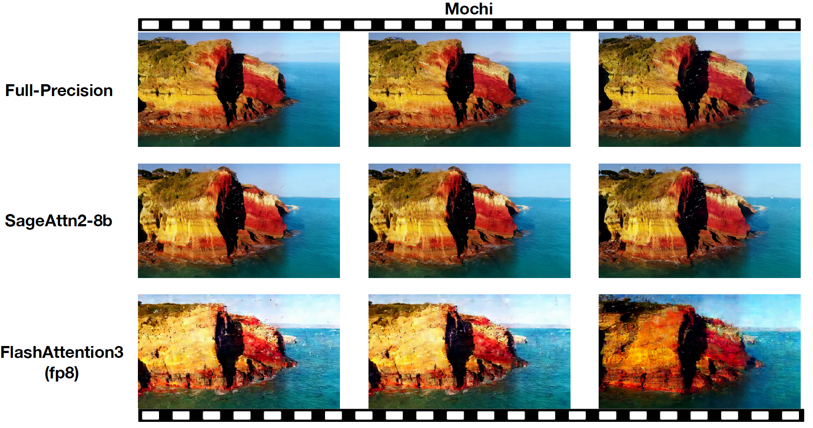
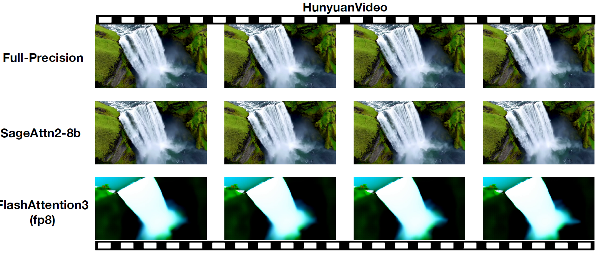

## Plug-and-play Example

**We can replace `scaled_dot_product_attention` easily.**  
We will take [CogvideoX](https://huggingface.co/THUDM/CogVideoX-2b) as an example:

**Just add the following codes and run!**
```python
from sageattention import sageattn
import torch.nn.functional as F

F.scaled_dot_product_attention = sageattn
```

Specifically,

```bash
cd example
<<<<<<< HEAD
python sageattn_cogvideo.py --compile
```

**You can get a lossless video in** `./example` **faster than by using** `python original_cogvideo.py --compile`.
=======
python cogvideox-2b.py --compile --attention_type sage
```

**You can get a lossless video in** `./example` **faster than by using** `python cogvideox-2b.py --compile`.
>>>>>>> latest

> **Note:** If you set `--compile`, the first run will be slower than the following runs. Please run it twice to get the accurate speed.

<<<<<<< HEAD
### Another Example for cogvideoX-2B SAT
We will take [Cogvideo SAT](https://github.com/THUDM/CogVideo/tree/main) as an example:
=======
## Modify Attention From Source Code
To have finer control over where to use SageAttention, you can modify a small subset of the source code. For example, in the `mochi.py` file, you can replace the `MochiAttnProcessor2_0` from diffusers with your own attention class.
>>>>>>> latest





## Parallel SageAttention Inference

Install xDiT(xfuser >= 0.3.5) and diffusers(>=0.32.0.dev0) from sources and run:

```bash
# install latest xDiT(xfuser).
pip install "xfuser[flash_attn]"
# install latest diffusers (>=0.32.0.dev0), need by latest xDiT.
git clone https://github.com/huggingface/diffusers.git
cd diffusers && python3 setup.py bdist_wheel && cd dist && python3 -m pip install *.whl
# then run parallel sage attention inference.
./run_parallel.sh
```


<<<<<<< HEAD
```python
    attn_output = sageattn(
        query_layer, key_layer, value_layer, 
        is_causal=not is_full
    )
```
## Parallel SageAttention Inference

Install xDiT(xfuser >= 0.3.5) and diffusers(>=0.32.0.dev0) from sources and run:

```bash
# install latest xDiT(xfuser).
pip install "xfuser[flash_attn]"
# install latest diffusers (>=0.32.0.dev0), need by latest xDiT.
git clone https://github.com/huggingface/diffusers.git
cd diffusers && python3 setup.py bdist_wheel && cd dist && python3 -m pip install *.whl
# then run parallel sage attention inference.
./run_parallel.sh
```


=======
>>>>>>> latest
